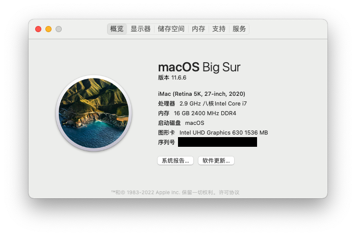

# Dell.ChengMing.3991-OpenCore-macOS.Big.Sur

戴尔成铭 3991 黑苹果 EFI文件。

厨子迟迟不给我发货，想找个机器先黑着，没想到公司的台式机刚好能支持，虽然或多或少有些问题，但是日常使用足够了。

# 机器信息

**CPU**：Intel(R) Core(TM) i7-10700 CPU @ 2.90GHz

**GPU**：NVIDIA Corporation TU117 [GeForce GTX 1650]

**网卡**：Realtek Semiconductor Co., Ltd. RTL8111/8168/8411 PCI Express Gigabit Ethernet Controller

**硬盘**：KIOXIA Corporation Device

**`dmidecode -t system`信息**：

```bash
System Information
	Manufacturer: Dell Inc.
	Product Name: ChengMing 3991
```

## 鸣谢

此仓库基于两个EFI整合，分别如下：

* **GitHub**：https://github.com/istarmeow/Hackintosh-Dell.ChengMing.3991-OpenCore.0.7.0-macOS.Big.Sur.11.4
* **张大妈**：https://post.smzdm.com/p/ar08nl5x/

特别感谢~

## 本仓库的意义

上边两个EFI我都试了，但是都有点点问题，因此我就对比了他们的文件和配置差异，做了一定的整合，修复了问题，可以非常舒服の使用了。

* 已知**GitHub**上EFI存在下边这几个问题：
  * 紫屏，频率太高了。此仓库已修复
  * 2K屏幕识别异常（印象里可选的最大分辨率只有1600）。此仓库已修复
* 已知**张大妈**上EFI存在下边这几个问题：
  * 自带声卡不识别。此仓库已修复
  * HDMI音频不识别。此仓库已修复，但是不能调节音量，只能通过显示器调节
  * 麦克风不识别。此仓库已修复
* 公共问题：
  * VGA无输出。有空再解

目前我已经使用了一阵子了，没有影响使用的问题了。

## 遗留问题

* 锁屏后，显示输出关闭，晃动鼠标不亮屏，要重新插拔HDMI。有空再解
* 英伟达的显卡，无解。请在BIOS中禁用PCI设备
* AirDrop和随航无法使用，反正有有线，懒得买无线网卡了
* VGA无输出。有空再解

## 操作步骤

**如果你也有这台机器，则可以按照下边的步骤，安装黑苹果。**

进行如下BIOS设置：

* SATA模式设置为AHCI
* 禁用UEFI安全启动
* 禁用Intel SGX
* 禁用睡眠，按照以往笔记本黑的经验，可能会睡死，干脆别睡了
* 禁用VT for Direct I/O
* 禁用PTT（TPM设备）
* 禁用内置喇叭（不嫌吵开着也行）
* 禁用PCI设备（目的是禁用英伟达的显卡，如果你没有独显可忽略）

下载镜像，你可以去Google或者一些论坛上找到**别人做好的带EFI**的dmg镜像，亲测官方的dmg不行，OC无法识别。

下载安装[balenaEtcher](https://www.balena.io/etcher/)，然后将刚刚带EFI的dmg刷进你的U盘或者移动硬盘，后文我们称这个U盘或者移动硬盘叫做**镜像盘**。刷写结束后，你就可以把**镜像盘**拔掉了，在安装时我们才再会用上它，现在就不用了。

接下来，你需要准备一个1G及以上空间的U盘，再小的也可以，只要能存下这个仓库就行，后文我们叫它**启动盘**，注意这个**启动盘**以后要一直插着，你可以找个老U盘，速度慢无所谓，能用即可。

使用DiskGenerius等工具，将**启动盘清空分区表**，如果分区类型是MBR的需要设置为GUID类型，然后新建一个1G的ESP分区（即用来存放EFI文件的分区），然后格式化并**分配盘符**（不然等下没办法复制文件进去），**然后就不要再分区了**，否则进macOS后会显示弹出设备（只有一个ESP分区的设备就不会显示了）。

此时，将这个仓库拉下来，然后下载[GenSMBIOS](https://github.com/corpnewt/GenSMBIOS)，按照提示运行其中的脚本，重新生成三码（MLB、SystemSerialNumber、SystemUUID），并将新生成的三码复制到`本项目/EFI/OC/config.plist`中，**为了防止序列号冲突封号（SN冲突会封AppleID）**，生成三码后记得去苹果官网检查保修试试看看是否存在设备，不存在就可以用了。此处，我将三码全部设置为0了，你可以直接在`config.plist`中搜索`#记得改#`，就可以找到三处需要修改的位置了。

现在，你已经修改好了OpenCore的配置（即三码），可以将修改后的仓库中的EFI目录整个复制到**启动盘**的根目录下了。Windows中向ESP分区复制需要使用管理员权限，使用管理员运行7zip即可。

插入你的**镜像盘**，同时保持**启动盘**插上，重启电脑，修改UEFI启动顺序，确保从**启动盘**启动，即可找到安装macOS选项，然后跟着一步一步走即可安装完成。安装结束后，将**镜像盘**拔掉，即可格式化掉用作其他用途，此**启动盘**需要一直插着，以便能够引导macOS启动。

然后即可正常使用~

# 注意

**谨慎更新，可能会有驱动不兼容的情况，做好备份再升级，提前看好changelog。**

可正常使用版本：



## 可以顺便看看我的博客

欢迎来交流技术♂♀（逃

**雪糕博客**：https://blog.xuegaogg.com

